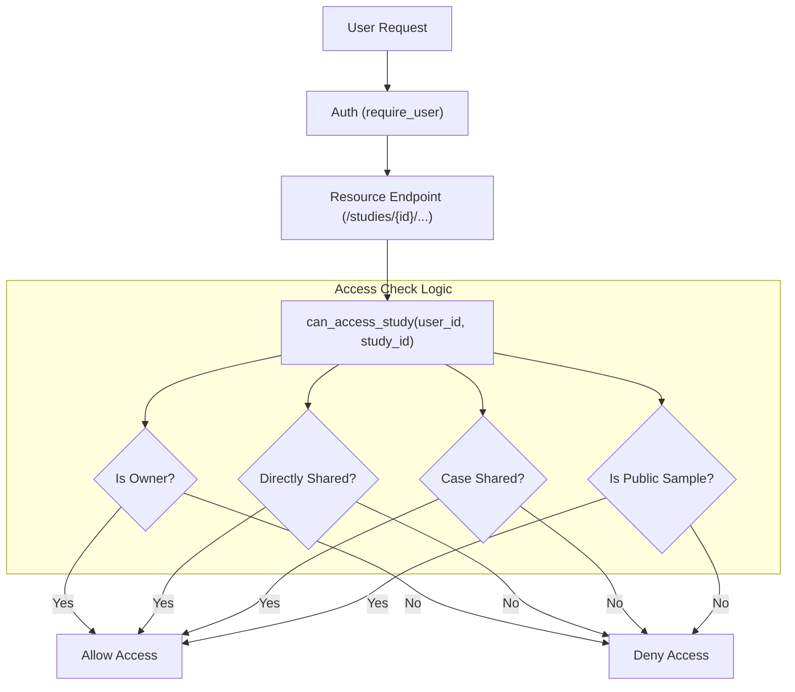

### 1. Security & Authorization Fixes

The primary finding is that while sharing logic exists, it is not consistently enforced on resource-level endpoints.

-   **Update `can_access_study`**: Refactor [converter/auth.py](c:\Users\donal.oshea_deciphex\DICOM Server\converter\auth.py) to check access across the new hierarchy model:
    -   Check `slides.owner_id`
    -   Check `slide_shares`
    -   Check `case_shares` (slides within shared cases)
    -   Check `slides.is_sample`
-   **Enforce Authorization**: Update [converter/main.py](c:\Users\donal.oshea_deciphex\DICOM Server\converter\main.py) to use `can_access_study` in all study-related endpoints (annotations, metadata, tiles, etc.).

### 2. Implement Case-Level Sharing

The database schema already supports `case_shares`, but the API does not expose it.

-   **New Endpoints**: Add `POST /cases/{case_id}/share` and `DELETE /cases/{case_id}/share/{user_id}` to `main.py`.
-   **New Auth Logic**: Add `share_case` and `unshare_case` functions to `auth.py`.

### 3. Consolidation and Cleanup

-   **Deprecated Code Removal**: Remove or update functions in `auth.py` that still use the legacy `study_owners` and `study_shares` tables.
-   **Consistent Naming**: Standardize on "slide" terminology for the new model (e.g., rename `share_study` to `share_slide` internally).

### 4. UI/UX Enhancements

-   **Case Sharing**: Update the frontend to allow sharing entire cases.
-   **Share Source Visibility**: Indicate in the UI if a slide is shared directly or inherited via a case share.
-   **Bulk Unshare**: Implement a bulk unshare feature for slides.

### Proposed Architecture for Access Control

